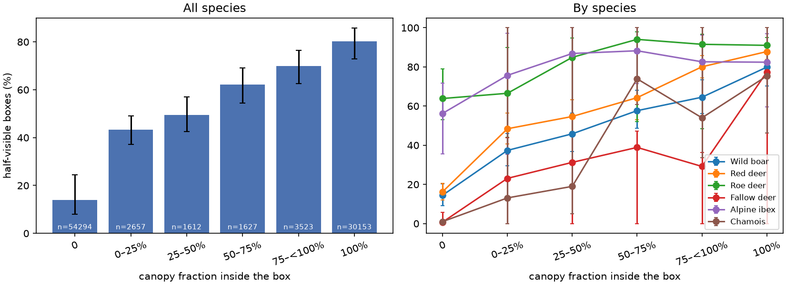
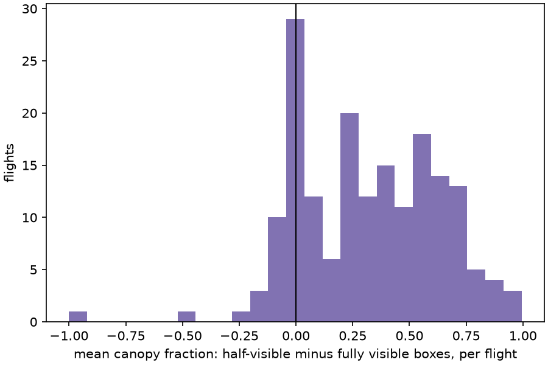
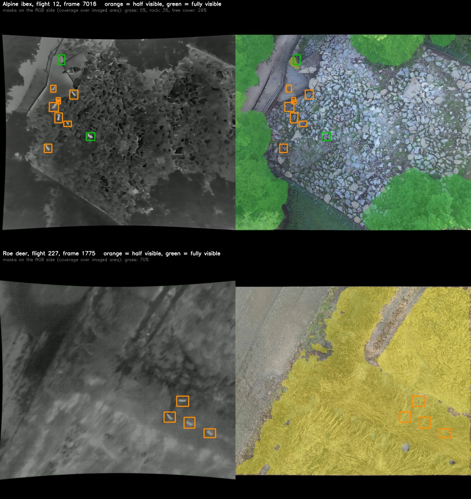
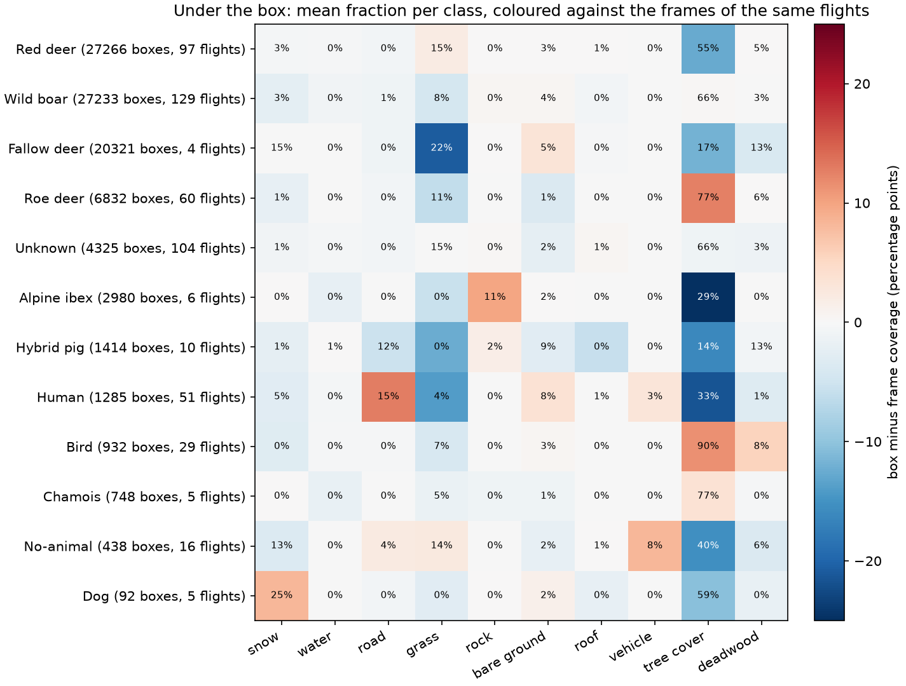
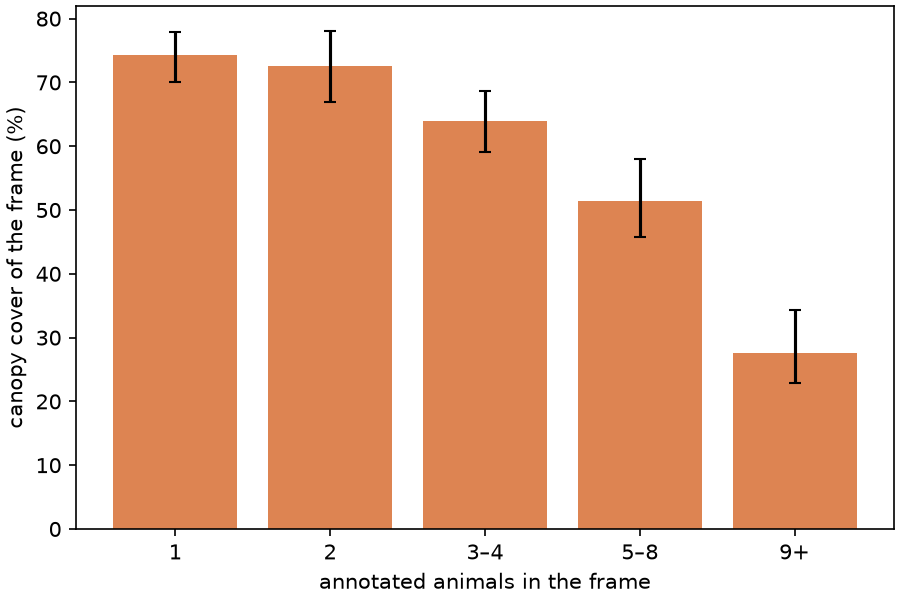
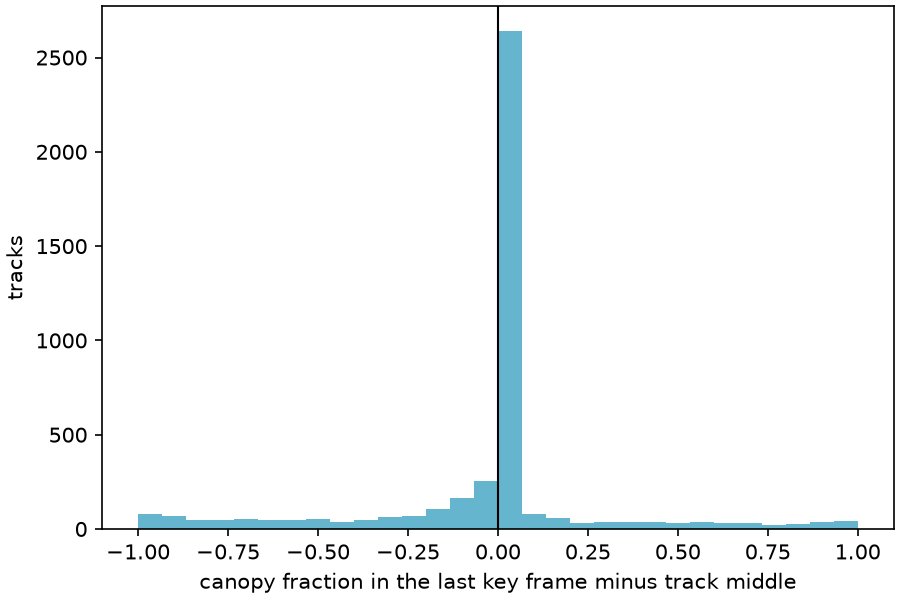

# Environment layers against the animal annotations

> ⚠️ Everything below joins **human** animal annotations with **machine-generated,
> unreviewed** environment masks (see [environment.md](environment.md)). The
> masks say where a model saw canopy, grass or rock; nobody has checked them
> against the ground. Treat the numbers as what the two releases say about each
> other, not as ecology.

The environment layers cover exactly the key frames that carry animal boxes,
so every box can be read against the masks of its own frame. This page reports
what comes out when that is done over the whole release: 301 flights, 29,832
key frames, 102,848 boxes. The question that started it was whether the
`visibility` label, which annotators set to 0.5 when an animal is partly
hidden, tracks the canopy. It does, strongly, and the rest of the page follows
the same join into species, roads, group size, sex and age, track ends and
season.

Two scripts reproduce it. Neither needs a video:

```bash
# annotation files and both environment layers for every flight that has
# them, about 1.3 GB in total, no video
python download_from_zenodo.py --version environment-all --annotations-only -o env_study/

# one row per box, per frame and per flight
python environment_features.py env_study/ --out features/

# the tables and figures on this page
python environment_insights.py features/ --figures figures/ --report docs/environment-insights-tables.md
```

[`environment-insights-tables.md`](environment-insights-tables.md) is the full
generated output; this page picks out what matters. Every rate below carries a
95% interval from a bootstrap over **flights**, because the boxes of one flight
are not independent: a drone hovering over one herd produces hundreds of nearly
identical rows. Regressions use flight-clustered standard errors for the same
reason.

## Read this first: what the join can and cannot see

* **The boxes are on the thermal view, the masks on the RGB view.** The two
  sensors are not perfectly registered; leaving thermal boxes unmoved puts
  them a mean 16 px off the animal in RGB
  ([label-transfer.md](label-transfer.md)). Rerunning everything with the
  `owl-transferred` RGB boxes on the 238 flights that have them moves the box
  centres by a median of 15 px, keeps 92% of boxes in the same canopy bin
  (correlation 0.98 between the two canopy fractions), and changes the
  half-visible rates per bin by at most three points. The registration blur
  is real but does not drive anything on this page.
* **Detection comes before habitat.** A box exists only where an annotator
  saw an animal in thermal. Anything that hides animals from a nadir thermal
  camera, closed canopy above all, removes them from the sample. Every
  "species prefers X" statement is really "species is *seen* on X".
* **The canopy mask is coarse.** Tree cover comes at an effective 40 cm on the
  ground, so it gives blobs, not crowns, and it has no class for shrubs,
  krummholz, reeds or tall grass. Where those hide an animal, the join sees a
  half-visible box on nothing.
* **Not every box has environment.** 2.7% of boxes have their centre in the
  RGB letterbox band, where no mask exists; 5.4% sit on frames flagged
  `undetermined`; 2.3% are on the seven flights without a canopy layer. Those
  are left out below. The estimated ground sampling distance is a median
  3.3 cm/px (p10 2.3, p90 4.4), so 128 px is about 4 m and a frame about
  35 m.

## 1. Occlusion follows canopy

`visibility` takes only two values in the release: 1.0 (fully visible, 60% of
boxes) and 0.5 (half visible, 40%). Against the fraction of the box under the
tree cover mask:



| canopy in box | boxes | flights | half-visible | 95% CI |
|---|---|---|---|---|
| none | 54,294 | 225 | 14% | 8–25% |
| 0–25% | 2,657 | 208 | 43% | 37–49% |
| 25–50% | 1,612 | 199 | 50% | 42–57% |
| 50–75% | 1,627 | 202 | 62% | 55–69% |
| 75–<100% | 3,523 | 242 | 70% | 63–77% |
| all | 30,153 | 271 | 80% | 73–86% |

The relation is monotone, it holds for every species with enough boxes, and it
holds **within flights**: on the 178 flights that have at least five boxes of
each kind, the mean canopy under half-visible boxes exceeds that under fully
visible ones on 142 (80%), median difference +0.32 (Wilcoxon p = 7·10⁻²³).
A logistic model of half-visibility on canopy fraction and species gives an
odds ratio of 20 (95% CI 13–30) for going from no canopy to full canopy, with a
McFadden pseudo-R² of 0.41 for a single covariate.



**Distance to the nearest canopy** carries the same signal, and the rate is not
flat even well away from any tree:

| nearest canopy from the box centre | boxes | half-visible | 95% CI |
|---|---|---|---|
| canopy inside the box | 39,572 | 75% | 69–80% |
| 16–48 px (0.5–1.5 m) | 3,799 | 36% | 29–43% |
| 48–128 px (1.5–4 m) | 9,334 | 25% | 19–31% |
| more than 128 px | 41,072 | 10% | 5–20% |

Which of the two matters more, canopy **in** the box or canopy **around** it?
Put both in one model and the neighbourhood wins: the canopy fraction of the
256 px window around the box gets an odds ratio of 13 (6–27) while the in-box
fraction drops to 2.4 (1.5–3.6). That is what a 16 px registration error and
a 40 cm mask would produce, and also what an animal standing at a crown edge
looks like. For a model predicting whether an animal will be partly hidden,
local canopy density is the better feature; the exact box overlap adds little.

**Canopy structure** at similar cover matters less than cover itself. Among
boxes touching canopy on frames with 20–80% cover, a canopy broken into many
crowns and gaps (highest tertile of mask edge density) gives 65% half-visible
against 74% for a solid block, and the tertiles differ in cover as well, so
the difference is at most a few points.

Two more classes carry information beyond canopy. **Deadwood** inside the box
raises the odds of half-visibility 4.2× (2.0–9.0) after canopy is accounted
for, which fits: standing dead crowns are bare branch structure, exactly what
hides an animal from above without registering as canopy. **Snow** under the
box lowers them (odds ratio 0.22, 0.08–0.58): an animal on a snowfield is in
the open, and the `undetermined` frames, which are mostly featureless snow or
fog, have a half-visible rate of 5% against 40% elsewhere.

### The half-visible boxes that have no canopy at all

14% of boxes with no canopy in them are still half visible. Three things
explain most of that.

The **thermal frame edge** is one. Boxes that touch the border are half
visible 21% of the time against 14% for boxes more than 32 px in, because an
animal cut off by the frame is annotated as partly visible too.

**Canopy just outside the box** is another. Away from the edge, boxes with no
canopy inside but more than 60% in the surrounding window are half visible 60%
of the time; with none in the window, 9%.

The rest is **species-specific, and concentrated in a few flights**. Roe deer
are half visible 64% of the time even with no canopy in the box, ibex 56%,
against 15% for boar and 16% for red deer. Per flight, this comes from a
handful of recordings where nearly every box is half visible. Looking at the
frames explains both, and neither is canopy:

* The **ibex** flights (8, 9, 11, 12, one September day) were recorded over
  the ibex enclosure of a wildlife park, and the animals stand between the
  boulders of a scree slope. The SAM 3 `rock` prompt finds 3% of that frame.
  It picks out individual large rocks and misses a boulder field, so the
  thing that half-hides the ibex is invisible to the layers.
* The **roe deer** flights (225, 227, 229, 230, 158 and others, December to
  March) are "Feldreh", roe deer living in open farmland, and every box sits
  on what SAM 3 calls `grass` at 100%. The frame below shows four of them
  bedded in tall dry grass in December, all but invisible in RGB: the layer
  is right that it is grass, and has no way to say that it is knee-high.

So the half-visible label is doing what it should, and it is the environment
layers that lack the class: scree, and low field vegetation. This is the
clearest case on the page where a missing environment class shows up as an
unexplained animal label, and the two flight groups are where to test a new
prompt.



## 2. What each species is seen standing on

Mean fraction of the box under each class, averaged per flight and then over
flights so that a 20,000-box enclosure flight counts once, and coloured
against the coverage of the key frames of the **same** flights:



Read the colour, not the number: a red cell means the species is on that
class more than the frames it was recorded in are covered by it.

* **Red deer** are seen in the gaps of their forests: 55% canopy under the
  box against 68% over the frames of the same flights (−12 points), and
  slightly more grass. That is detection as much as preference.
* **Roe deer** go the other way, +13 points canopy under the box against
  their frames, and less grass and bare ground. They are the one ungulate the
  join places *inside* the canopy more than around it, and also the one with
  the highest half-visible rate overall (75% of adults).
* **Wild boar** sit on their frames' average, ±4 points on every class.
* **Alpine ibex** are 43 points below their frames' canopy, with rock (+10)
  taking the difference: the six September flights are one wildlife park
  enclosure, a scree slope ringed by trees, and the ibex stayed on the scree.
* **Birds** are +11 canopy and +6 deadwood: in trees and on dead ones. They
  are the only class enriched on deadwood.
* **Humans** are +13 road and −22 canopy; the `No-animal` class is +8
  vehicle. Both are what the SAM 3 prompts were chosen to find.
* **Dogs** are +8 snow, on five flights, presumably alongside a person.

Fallow deer come from four flights and hybrid pigs from ten, so their rows
describe those enclosures rather than the species.

## 3. Roads, roofs, vehicles, water

Only flights on which the class fires at all are counted, so this describes
terrain where the feature exists. In frame means within about 20 m.

| class | species | flights | in frame | within 128 px (~4 m) |
|---|---|---|---|---|
| road | wild boar | 39 | 50% | 14% |
| road | red deer | 24 | 28% | 2% |
| road | human | 35 | 47% | 40% |
| roof | red deer | 30 | 59% | 37% |
| roof | wild boar | 43 | 24% | 0% |
| vehicle | human | 27 | 63% | 42% |
| water | wild boar | 32 | 25% | 6% |
| water | alpine ibex | 6 | 37% | 0% |
| deadwood | roe deer | 53 | 51% | 30% |
| deadwood | wild boar | 107 | 54% | 21% |

Wild boar are the wild species most often near a track (14% of boxes within
4 m on flights with a road). Red deer within 4 m of a roof on 37% of boxes
across 30 flights is not deer on buildings: several red deer flights were
recorded over enclosures and feeding sites, and the roof is the feeding
station or hide. Humans are near their own roads and vehicles, as expected.

## 4. Larger groups are recorded in the open, but not within a flight

| animals in frame | frames | flights | canopy cover of the frame |
|---|---|---|---|
| 1 | 13,355 | 283 | 74% (70–78) |
| 2 | 5,442 | 240 | 73% (67–78) |
| 3–4 | 4,224 | 202 | 64% (59–69) |
| 5–8 | 2,783 | 121 | 51% (46–58) |
| 9+ | 2,335 | 55 | 28% (23–34) |



The gradient is steep and entirely between flights. Within a flight, the
correlation between the number of animals in the frame and canopy around each
box has a median near zero for boar, red deer and roe deer (Spearman −0.05 to
+0.04 over 39–95 flights each). Big groups were *recorded* in open terrain,
enclosures and winter meadows, and singles in forest; nothing in the release
says a group moves into the open.

## 5. Sex and age: annotated in the open, no habitat difference within flights

Whether the annotator could tell sex and age depends on where the animal is:

| canopy in box | sex annotated | age annotated |
|---|---|---|
| none | 51% | 75% |
| 0–50% | 34% | 65% |
| 50–<100% | 25% | 65% |
| all | 20% | 67% |

So any pooled comparison of males against females, or juveniles against
adults, is confounded by where each could be identified. Pooled over flights,
boar juveniles sit under less canopy than adults (0.45 vs 0.67) and boar
females under more than males (0.83 vs 0.44). Within the flights that recorded
both groups, the differences vanish: median difference in canopy of +0.01 for
boar juveniles against adults over 19 flights, −0.004 for red deer over 28,
+0.005 for red deer males against females over 40 (all p > 0.05). Only ibex
juveniles come out under slightly less canopy than adults on all six flights
(−0.05, p = 0.03). Attribute-level habitat differences in this release are
between flights, not within them.

## 6. Tracks end at the frame edge, not under the trees

For 4,360 tracks with at least four key frames on 269 flights, the last key
frame is compared with the middle of the track:

* Canopy under the last box is **lower** than in the middle of the track
  (0.47 vs 0.51, p = 6·10⁻¹⁹), and half-visibility is only marginally higher
  (54% vs 52%, p = 0.001).
* 70% of tracks end within 40 px of the imaged-area boundary; 21% end away
  from the edge with at least half the box under canopy.



Tracks in this release stop because the animal or the drone leaves the frame,
not because the annotator lost the animal under a crown. The one exception is
alpine ibex, whose 97 tracks end with +0.56 more canopy than their middle:
in the enclosure of section 1, animals that walked from the scree into the
trees along its edge stopped being tracked there. Roe deer (−0.12) and boar
(−0.07) end in the open if anywhere.

## 7. Season

Snow in the frames is a January and February affair (47% and 17% mean frame
coverage per flight, zero from March to October) and grass rises to
20–30% in November, December and March, when canopy cover per flight drops to
35–50% against 83–88% in April, May and July. Two percent of boar, red deer
and roe deer boxes have more than half their area on snow; the 55% for fallow
deer is one January enclosure flight. Ibex and chamois were recorded only in
September, on one day, in one park.

## 8. Other questions the join could answer

Things the tables support that are not worked out here:

* **Detectability rather than habitat.** With interpolated tracks and the
  models rerun on the frames in between, a track's canopy series gives when
  and where each animal drops out of thermal view, per species and per
  canopy density. That is the training signal a "how much of this forest can
  a drone survey" model needs, and it is the natural follow-up to section 1.
* **A canopy-aware detector benchmark.** Split the test set by canopy
  fraction under the box and report recall per bin; section 1 predicts
  recall to fall by more than half from open ground to closed canopy.
* **A missing low-vegetation class.** The roe deer and ibex flights of
  section 1 are the place to look for it. A `shrub` or `dwarf pine` prompt
  swept over those flights, as the class names in
  [environment.md](environment.md#choosing-the-class-names) were, would say
  whether SAM 3 can find it.
* **Water and roads as movement corridors** need tracks across frames, not
  key frames: the distance series along a track against the road mask, which
  the dense masks of [`examples/environment/`](../examples/environment/) show
  how to produce.
