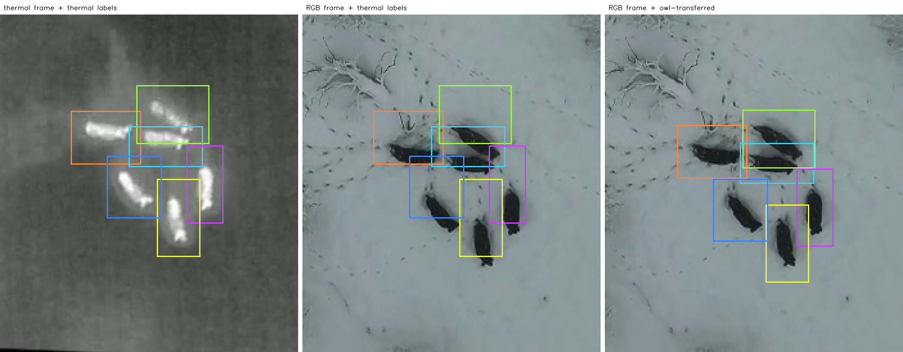

# Thermal to RGB label transfer

The thermal and RGB views are recorded simultaneously but are not perfectly
aligned, so a box annotated on a thermal frame does not sit on the animal in
the corresponding RGB frame. Two complementary approaches to fixing that, and
the released annotations produced by one of them.

## Thermal → RGB Label Transfer with OWL

Move thermal MOT annotations onto the RGB view by detecting the animals in RGB
with [OWL](https://github.com/microsoft/MegaDetector-Overhead) (Overhead
Wildlife Locator) and matching its points to the thermal box centres with the
Hungarian algorithm. See [RGB–Thermal Frame Matching](#rgbthermal-frame-matching)
for how this relates to the template-matching toolkit, and
[`owl_label_transfer.ipynb`](../owl_label_transfer.ipynb) for a full walkthrough
including how to produce the detections.

Only `bb_left` and `bb_top` are modified; every other column is written back
verbatim, so the output is a drop-in replacement annotation file. A
`_provenance.csv` sidecar records where each box's shift came from.

```bash
# single flight, detections already in image pixels
python transfer_labels.py 119_thermal_mot.txt \
    -d examples/owl_transfer/owl_detections_flight119.csv \
    -o 119_rgb_mot.txt

# score the result against the accepted RGB annotations of the matched release
python transfer_labels.py 119_thermal_mot.txt \
    -d examples/owl_transfer/owl_detections_flight119.csv \
    -o 119_rgb_mot.txt --reference 119_rgb_mot_accepted.txt

# a folder of flights, raw OWL output (heatmap coordinates -> scale by 2)
python transfer_labels.py ./labels -d ./detections -o ./labels_rgb \
    --detection-scale 2 --report metrics.json
```

Over the whole `matched` subset (252,857 boxes, 234,264 with an accepted RGB
reference) this reduces the mean centre error from **14.97 px to 4.31 px** and
raises the share of boxes at IoU > 0.5 from **51.5% to 95.9%**. Full tables,
ablations and failure modes are in the notebook.

### The released `owl-transferred` annotations

> ⚠️ **Experimental.** These annotations are machine-generated and have not
> been reviewed by hand. The aggregate numbers below are good, but they are an
> average over 238 flights and a single flight can be confidently wrong — see
> [what goes wrong](#what-goes-wrong) before training on them. Coverage and
> content may change in a future revision, so cite the DOI you actually used.

The method has been run over the whole base release and published as its own
dataset version, so the labels can be downloaded rather than recomputed:

```bash
python download_from_zenodo.py --version owl-transferred -f 119 --unzip
```



*Flight 146, frame 3448, cropped to the animals. Left: the thermal annotation
as released in `base`. Middle: those same boxes drawn on the RGB frame — they
sit above the boar. Right: what `owl-transferred` ships. The correction here is
11–20 px downward, and all six boxes were placed by a detection of their own.
[`introduction.ipynb`](../introduction.ipynb) reproduces this figure.*

Per flight it ships `<id>_rgb_gt.txt` (the transferred RGB annotations, in the
same MOT format as the base `<id>_gt.txt`), `<id>_provenance.csv` (where each
box's shift came from) and `<id>_owl_detections.csv` (the raw OWL points, in
image pixels, so the transfer can be re-run without a GPU).

**Coverage: 238 of the 386 flights**, 99,230 boxes. Of the rest, 85 flights
carry no thermal annotations at all, so there is nothing to transfer, and 63
produced no OWL detection that could be matched anywhere in the flight — the
animals are visible in thermal but not detectable in RGB, typically under
canopy. Those 63 are omitted rather than shipped: with no match anywhere, the
output would be a byte-identical copy of the thermal boxes, and publishing that
as an RGB annotation would misrepresent it.

**The annotations are in lock-step with the thermal ones.** Only `bb_left` and
`bb_top` differ. Row order, `frame`, `track_id`, `bb_width`, `bb_height` and
every remaining column are identical to the base `<id>_gt.txt`, verified across
all 301 transferred flights and 102,848 boxes, so the two views join directly
on `(frame, track_id)`.

Measured against the human-accepted RGB annotations of the `matched` release
(75 flights, 17,165 boxes that could be paired):

| | mean | median | p90 |
|---|---|---|---|
| unchanged (thermal boxes) | 15.98 px | 14.08 | 27.82 |
| **transferred** | **5.22 px** | **3.81** | **9.19** |

87.1% of boxes end up closer to the reference than leaving them alone. Centre
error is reported rather than IoU because base v2 refined the box sizes, so an
IoU against the older `matched` boxes would mix label revision into a number
that reads as transfer accuracy.

The error is higher than the 4.31 px measured on `matched` itself for a
structural reason: the base release annotates sparse key frames rather than
every frame, so per-track temporal smoothing spans fewer samples and 49.2% of
boxes take the consensus curve instead of a detection of their own.

#### What goes wrong

Averages over 238 flights hide the cases that matter, and this is why the
release is marked experimental.

**An unannotated animal steals the assignment.** This is the worst failure and
it is systematic rather than random. Where a frame holds more animals than the
thermal annotation covers, OWL correctly detects all of them, and the nearest
detection to a thermal box can be the *neighbouring* animal. The pipeline then
agrees with itself: the consensus curve is built from those same wrong matches,
so the second pass re-confirms them and the resulting shift looks stable and
confident. Nothing internal to the method catches this — every consistency
check it has is satisfied. Such a flight can end up worse than doing nothing.

**A false positive on a distractor.** A feeding trough or similar warm, animal
shaped object draws a detection and a box gets handed to it. The consensus
prior suppresses most of these, because the implied shift disagrees with the
rest of the frame.

Two things help you find these without re-running anything:

- `<id>_provenance.csv` gives each box its `source` (`owl`, `smoothed`,
  `consensus` or `unchanged`), the shift applied, the assignment distance and
  the detection score. A flight whose shifts are large, uniform and highly
  confident, but disagree with neighbouring flights from the same site, is
  worth a look.
- `<id>_owl_detections.csv` lets you re-run `transfer_labels.py` with different
  gates or a different smoothing window on CPU, and compare.

Flights where the method found nothing to match at all are omitted from the
release rather than shipped unchanged, so an `unchanged` row means a box that
the detector missed in an otherwise-matched flight, not a whole flight that
silently failed.

## RGB–Thermal Frame Matching

Although the drones record RGB and thermal imagery simultaneously, the two modalities are **not temporally synchronized**. Temporal offsets vary with flight dynamics, so annotations from thermal frames cannot be directly transferred to RGB images — correspondence must be established at sequence or frame level.

The dataset includes a **local patch-based matching strategy** to align thermal annotations with their RGB counterparts:

1. For each thermal detection, the annotated crop is extracted.
2. A larger search region is generated in the corresponding RGB frame by expanding the bounding box.
3. The RGB region is converted to grayscale and processed using multiple transformations (e.g., CLAHE and edge-based filtering), producing five different variants.
4. Each variant is matched to the thermal crop via a sliding-window approach, selecting the position with the highest matching confidence.
5. For frames with **multiple detections**, alignment is accepted if pixel shift estimates across methods agree within ±10 pixels, and the most consistent candidate is selected.
6. For frames with a **single detection**, a stricter majority consensus is required; otherwise the sample is discarded.

The implementation is available in a separate repository:

🔗 **[BAMBI BBox Corrections](https://github.com/HugoMarkoff/BAMBI_BBox_Corrections)**

### Detector-based alternative

A second, complementary strategy is included in this repository as
[`transfer_labels.py`](../transfer_labels.py), walked through in
[`owl_label_transfer.ipynb`](../owl_label_transfer.ipynb). Instead of matching the
thermal appearance into the RGB frame, it **locates the animals in RGB directly**
with [OWL](https://github.com/microsoft/MegaDetector-Overhead) (Overhead Wildlife
Locator, Microsoft AI for Good), a point detector for aerial wildlife imagery,
and re-centres each thermal box on the point it was assigned to.

1. Per frame, thermal box centres are matched to OWL points by Hungarian
   assignment on Euclidean distance, under a distance gate.
2. The median shift per frame, smoothed over time, forms a consensus curve;
   misalignment is largely a whole-frame effect that drifts slowly.
3. The assignment is repeated with that consensus as a prior, which resolves
   most cases where a box would otherwise be handed its neighbour's point.
4. Each track's shift is smoothed over time; boxes with no match take the
   consensus.

The two approaches fail differently: template matching needs the animal to
*look* similar across modalities, while the detector-based route needs it to be
*detectable* in RGB and unambiguous among its neighbours. Measured against the
accepted RGB annotations of the `matched` release, the detector-based transfer
agrees to a mean centre error of 4.31 px (95.9% of boxes at IoU > 0.5), against
14.97 px (51.5%) for using the thermal boxes unchanged.
