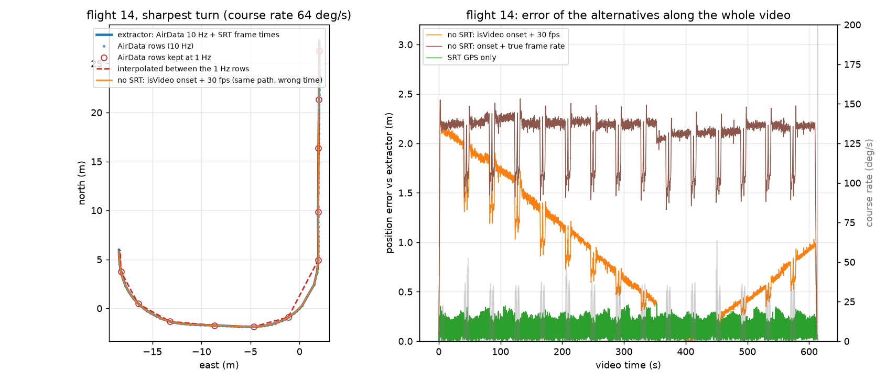

# Is the SRT + AirData combination necessary?

The pose extractor (`bambi_detection/src/bambi/webgl/timed_pose_extractor.py`)
combines two DJI logs: the SRT subtitle file, which carries a GPS position
and a timestamp for every video frame at 30 Hz but with coarse coordinates
and on the camera's clock, and the AirData flight log, which has precise
positions at 5 to 10 Hz on the controller's clock and no notion of frames.
The extractor takes the positions from AirData, the frame times from the SRT,
fits one clock offset by matching the two GPS traces, and falls back to the
SRT positions inside AirData gaps longer than 2 s.

This evaluation asks whether interpolating the AirData rows alone would do,
and where the SRT actually matters. The guess going in was that straight
transects are fine and corners are the problem.

## Method

`srt_airdata_sync_eval.py` reads the raw SRT files and `air_data.csv` of a
flight (fetched with `download_from_zenodo.py --version raw --annotations-only`)
and reproduces the extractor: the AirData rows of the `isVideo` run, the SRT
frame times, the fitted clock offset. For flights 146 and 14 this reproduction
matches the published poses to 0.00 m and 0 ms, so every error below is
measured against the extractor's own output. Frames are classified by the
course-over-ground rate of the AirData track: straight (below 5 deg/s) and
turning (above 20 deg/s), while moving faster than 1 m/s.

Three alternatives are measured:

- **AirData only, no SRT**: frame times from the `isVideo` flag onset plus a
  constant 30 fps (and a variant with the true mean frame rate), positions
  interpolated from the log.
- **AirData at reduced log rates**: rows thinned to 2, 1, 0.5 and 0.2 Hz and
  linearly interpolated; the error is measured on the dropped rows.
- **SRT GPS only**: the SRT coordinates at the fitted frame times.

`animal_georef_compare.py` turns the same comparison into a video: the box
centre of every annotated boar of flight 146 is cast onto the terrain model
under the three poses and drawn on a top-down map next to the thermal frame.

## Results over 11 flights

```
flight frames  AirData gap>2s maxgap SRT dec clock off onset err true fps noSRT mean noSRT p95 1Hz turn p95 SRT-only mean speed
     0  11566      5 Hz      0   1.6s       6    +1.20s    +0.89s   29.992      2.24m     2.66m        0.32m         0.12m  3.0
   100  11736      5 Hz      0   0.2s       6    +1.43s    +0.24s   29.984      0.46m     0.78m        0.29m         0.08m  3.0
   122  13041      5 Hz      0   0.4s       6    +0.22s    +0.78s   29.982      1.91m     2.34m        0.30m         0.09m  3.0
   146  13646      5 Hz      0   0.4s       5    +0.21s    +0.49s   29.981      1.22m     2.37m        0.21m         0.37m  4.9
   152  27270      5 Hz      0   0.2s       6    +1.17s    +0.04s   29.981      0.60m     1.32m        0.44m         0.07m  2.8
   163  12870      5 Hz      0   0.4s       6    +0.57s    +0.96s   29.975      3.75m     4.56m        0.34m         0.14m  4.8
    17  30464      5 Hz      0   1.4s       5    +0.39s    -0.40s   28.407      2.13m     5.51m        0.33m        27.40m  3.9
   277  11177     10 Hz      0   0.1s       6    +0.44s    +0.33s   29.987      0.81m     1.58m        0.34m         0.09m  3.0
   350  25196     10 Hz      1 321.8s       6    -4.11s    +4.72s   29.968      9.00m    13.42m        2.08m        82.49m  2.9
   380  11820     10 Hz      0   0.1s       6    +1.07s    +0.29s   29.990      0.44m     0.57m        0.25m         0.06m  2.0
    50  10412      5 Hz      0   1.0s       5    +0.78s    +0.38s   29.982      1.03m     1.93m         nanm         0.39m  4.7
```

`onset err` is how late the `isVideo` flag comes on after the fitted time of
the first frame; `noSRT mean` is the resulting position error of every frame
when the frames are timed from that flag at 30 fps; `1Hz turn p95` is the
interpolation error in turns when the AirData log is thinned to one row per
second; `SRT-only mean` is the error of the SRT coordinates. Flight 17 is five
recordings with stop/start gaps and flight 350 has a 322 s hole in its AirData
log inside the video, so their no-SRT and SRT-only columns reflect those
defects rather than the sensors (see below). Flights 200, 250 and 300 could not
be fetched (their raw depositions answer 403).

## Detailed run for flights 146 and 14

```
====================================================================================================
flight 146: 2 SRT file(s), 13646 video frames, AirData 5 Hz, video segment 457 s (2282 rows), gaps > 2 s: 0, largest gap 0.40 s
  median ground speed while moving 4.90 m/s, straight 74 % / turning 0 % of the video time
  fitted SRT->AirData clock offset +0.206 s   (first frame on the AirData clock: 11:39:00.905990)
  reproduction vs published poses: time |dt| median 0 ms, position n= 12191  mean   0.00  median   0.00  p95   0.00  max   0.01

[A] AirData only, no SRT: frame times from the isVideo flag onset + constant 30 fps
    isVideo onset is +494 ms from the fitted first-frame time; over the video the SRT frame clock drifts +282 ms against 30 fps
    position error, all frames (m)             n= 13646  mean   1.22  median   1.24  p95   2.37  max   2.86
      straight flight                          n= 10104  mean   1.60  median   1.67  p95   2.42  max   2.86
      turning                                  n=     2  mean   0.78  median   0.78  p95   0.80  max   0.80
    same with the true frame rate (29.981 fps) n= 13646  mean   1.70  median   2.33  p95   2.67  max   3.01
    a pure timing error of dt costs speed x dt: at the median speed 4.9 m/s -> 0.1 s = 0.49 m, 0.5 s = 2.45 m

[B] AirData only, correctly synced, but at a lower log rate (linear interpolation between rows)
    error of the interpolated rows against the rows that were dropped, metres
     1.7 Hz (0.6 s between rows): all          n=  1521  mean   0.03  median   0.01  p95   0.11  max   0.14
          straight                             n=  1123  mean   0.03  median   0.01  p95   0.12  max   0.14
          turning                                (no samples)
     1.0 Hz (1.0 s between rows): all          n=  1825  mean   0.07  median   0.02  p95   0.26  max   0.40
          straight                             n=  1350  mean   0.08  median   0.02  p95   0.28  max   0.40
          turning                              n=     1  mean   0.21  median   0.21  p95   0.21  max   0.21
     0.5 Hz (2.0 s between rows): all          n=  2053  mean   0.24  median   0.06  p95   0.90  max   1.44
          straight                             n=  1515  mean   0.24  median   0.04  p95   0.92  max   1.44
          turning                              n=     1  mean   0.98  median   0.98  p95   0.98  max   0.98
     0.2 Hz (5.0 s between rows): all          n=  2190  mean   1.25  median   0.72  p95   4.09  max   5.36
          straight                             n=  1617  mean   1.10  median   0.33  p95   4.13  max   5.36
          turning                              n=     1  mean   2.59  median   2.59  p95   2.59  max   2.59

[C] SRT GPS only (no AirData), after the same clock offset
    position error (m), all frames             n= 13646  mean   0.37  median   0.37  p95   0.65  max   1.01
      straight                                 n= 10104  mean   0.38  median   0.37  p95   0.67  max   1.01
      turning                                  n=     2  mean   0.25  median   0.25  p95   0.26  max   0.26
    SRT latitude/longitude have 5 decimals -> 1.11 m quantisation

[D] heading between AirData rows: compass heading interpolated at a lower log rate
     1.7 Hz: heading error (deg), all          n=  1521  mean   0.05  median   0.03  p95   0.20  max   1.17
          straight                             n=  1123  mean   0.06  median   0.03  p95   0.20  max   1.17
          turning                                (no samples)
     1.0 Hz: heading error (deg), all          n=  1825  mean   0.07  median   0.02  p95   0.26  max   1.50
          straight                             n=  1350  mean   0.07  median   0.02  p95   0.26  max   1.50
          turning                              n=     1  mean   0.08  median   0.08  p95   0.08  max   0.08
     0.5 Hz: heading error (deg), all          n=  2053  mean   0.08  median   0.03  p95   0.30  max   1.80
          straight                             n=  1515  mean   0.08  median   0.03  p95   0.31  max   1.80
          turning                              n=     1  mean   0.22  median   0.22  p95   0.22  max   0.22
    SRT gimbal yaw vs AirData gimbal heading (deg) n= 13646  mean   3.70  median   3.70  p95   3.77  max   4.16
====================================================================================================
flight 14: 2 SRT file(s), 18393 video frames, AirData 10 Hz, video segment 615 s (5926 rows), gaps > 2 s: 0, largest gap 0.70 s
  median ground speed while moving 4.97 m/s, straight 82 % / turning 12 % of the video time
  fitted SRT->AirData clock offset +0.682 s   (first frame on the AirData clock: 08:41:12.770367)
  reproduction vs published poses: time |dt| median 0 ms, position n= 17996  mean   0.00  median   0.00  p95   0.00  max   0.02

[A] AirData only, no SRT: frame times from the isVideo flag onset + constant 30 fps
    isVideo onset is +430 ms from the fitted first-frame time; over the video the SRT frame clock drifts +636 ms against 30 fps
    position error, all frames (m)             n= 18393  mean   0.88  median   0.76  p95   2.03  max   2.43
      straight flight                          n= 15125  mean   0.92  median   0.80  p95   2.04  max   2.43
      turning                                  n=  2182  mean   0.68  median   0.57  p95   1.48  max   2.18
    same with the true frame rate (29.969 fps) n= 18393  mean   2.08  median   2.18  p95   2.26  max   2.45
    a pure timing error of dt costs speed x dt: at the median speed 5.0 m/s -> 0.1 s = 0.50 m, 0.5 s = 2.48 m

[B] AirData only, correctly synced, but at a lower log rate (linear interpolation between rows)
    error of the interpolated rows against the rows that were dropped, metres
     2.0 Hz (0.5 s between rows): all          n=  4740  mean   0.02  median   0.01  p95   0.06  max   0.45
          straight                             n=  3898  mean   0.01  median   0.01  p95   0.03  max   0.11
          turning                              n=   558  mean   0.06  median   0.05  p95   0.09  max   0.31
     1.0 Hz (1.0 s between rows): all          n=  5333  mean   0.05  median   0.02  p95   0.24  max   0.79
          straight                             n=  4386  mean   0.02  median   0.01  p95   0.08  max   0.42
          turning                              n=   628  mean   0.20  median   0.20  p95   0.34  max   0.70
     0.5 Hz (2.0 s between rows): all          n=  5629  mean   0.15  median   0.02  p95   0.86  max   2.06
          straight                             n=  4630  mean   0.05  median   0.02  p95   0.21  max   1.18
          turning                              n=   664  mean   0.71  median   0.74  p95   1.11  max   2.06
     0.2 Hz (5.0 s between rows): all          n=  5807  mean   0.75  median   0.03  p95   4.27  max   6.95
          straight                             n=  4778  mean   0.26  median   0.03  p95   1.86  max   5.83
          turning                              n=   685  mean   3.35  median   3.59  p95   5.40  max   6.95

[C] SRT GPS only (no AirData), after the same clock offset
    position error (m), all frames             n= 18393  mean   0.13  median   0.12  p95   0.26  max   0.38
      straight                                 n= 15125  mean   0.13  median   0.13  p95   0.26  max   0.38
      turning                                  n=  2182  mean   0.10  median   0.10  p95   0.21  max   0.30
    SRT latitude/longitude have 6 decimals -> 0.11 m quantisation

[D] heading between AirData rows: compass heading interpolated at a lower log rate
     2.0 Hz: heading error (deg), all          n=  4740  mean   0.06  median   0.02  p95   0.26  max   2.40
          straight                             n=  3898  mean   0.03  median   0.02  p95   0.10  max   0.78
          turning                              n=   558  mean   0.21  median   0.10  p95   0.80  max   1.58
     1.0 Hz: heading error (deg), all          n=  5333  mean   0.11  median   0.04  p95   0.49  max   2.65
          straight                             n=  4386  mean   0.05  median   0.02  p95   0.15  max   1.41
          turning                              n=   628  mean   0.42  median   0.20  p95   1.58  max   2.65
     0.5 Hz: heading error (deg), all          n=  5629  mean   0.14  median   0.06  p95   0.57  max   2.52
          straight                             n=  4630  mean   0.07  median   0.04  p95   0.20  max   1.97
          turning                              n=   664  mean   0.51  median   0.32  p95   1.84  max   2.52
    SRT gimbal yaw vs AirData gimbal heading (deg) n= 18393  mean  11.01  median  11.00  p95  11.10  max  12.70
```



Left: the sharpest turn of flight 14; interpolating between 1 Hz rows cuts
the corner by 0.2 m, while the no-SRT path is the same path shifted in time.
Right: the error of the alternatives along the whole video; grey spikes are
the turns.

## Findings

1. **Interpolation between AirData rows is not the problem.** At the native
   5 to 10 Hz the error is centimetres, corners included. Thinned to one row
   per second it is 2 cm on straight legs and about 0.2 m in the sharpest
   turns (p95 0.2 to 0.44 m across flights). Only at one row per 5 s do the
   corners lose metres. Heading interpolates equally well: under 0.5 deg mean
   in turns at 0.5 Hz.
2. **The synchronisation is the problem.** The `isVideo` flag comes on 0.04 to
   0.96 s after the first frame, a different amount on every ordinary flight,
   so it cannot be calibrated away. At 3 to 5 m/s that is 0.4 to 3.8 m on
   every frame, largest on the straight legs where the drone is fastest. Using
   the true mean frame rate instead of 30 fps does not help. The SRT clock
   itself is 0.2 to 1.4 s off the AirData clock, which the fitted offset
   absorbs.
3. **Sometimes the log is not there.** Flight 350 has a 322 s hole in its
   AirData log inside the video, about 39 % of its frames; flight 17 is five
   recordings started and stopped by hand, 1072 s of video against an 807 s
   `isVideo` run. In both cases only the per-frame SRT timestamps and
   positions place those frames.
4. **The SRT positions are the expendable part.** Where AirData exists, its
   interpolation beats the SRT coordinates (0.06 to 0.4 m mean error, 1 m
   quantisation on the 5-decimal files).
5. Side finding: SRT gimbal yaw and AirData gimbal heading differ by a
   constant 3.7 deg on flight 146 and 11 deg on flight 14.

**Recommendation:** keep the current split. Positions from AirData, frame
times and the fitted clock offset from the SRT, and the SRT as the fallback
inside log gaps.

## Reproducing

```bash
python download_from_zenodo.py --version raw --annotations-only -f 146 -o raw/146
python evaluation/srt_airdata_sync_eval.py            # detailed run, edit the paths at the bottom
python evaluation/srt_airdata_sync_eval.py --scan raw  # one line per flight folder
python mot_interpolation.py bambi_downloads bambi_downloads/interp
python evaluation/animal_georef_compare.py --flight 146 --data bambi_downloads --raw raw/146 -o 146_georef_compare.mp4
```
