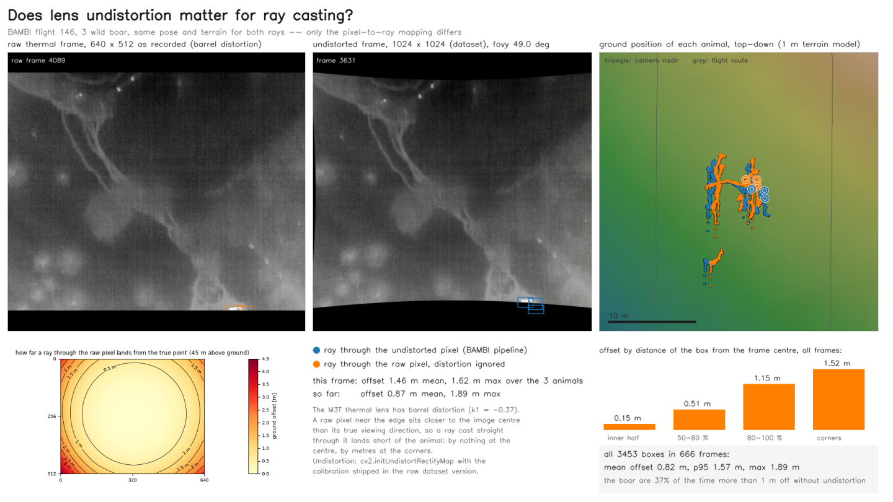

# What lens undistortion does for the ray casting

Every recording in the base dataset is undistorted before anything else
happens to it: the raw thermal frame (640 x 512) is remapped with the
calibration shipped in the raw dataset version (`T_calib.json`) into the
square 1024 x 1024 frame the annotations, the poses and the terrain
projection refer to. This evaluation shows what that step is worth for the
geo-referencing, with the wild boar of flight 146 that `introduction.ipynb`
uses.

`undistortion_effect.py` geo-references every annotated box twice, with the
same camera pose, the same correction and the same 1 m terrain model:

- **through the undistorted pixel**, the dataset pipeline: the box centre in
  the 1024 x 1024 frame becomes a ray through the pinhole camera the frame was
  built for and is cast onto the terrain;
- **through the raw pixel, distortion ignored**: the same box centre is mapped
  back into the raw frame through the lens model, and a ray is cast through
  that raw pixel as if the lens were a plain pinhole, which is what skipping
  the undistortion amounts to.

The difference between the two ground points is the error the undistortion
removes. It is drawn as a video: the raw frame with the boxes mapped back into
it, the dataset frame with its boxes, a top-down map with both ground
positions per animal and their offsets, the offset over the whole raw frame
for the current pose, and the running numbers.



## The undistortion the dataset was built with

The raw calibration is a standard OpenCV model with strong barrel distortion
(k1 = -0.37, k2 = 0.21, k3 = -0.02). The new camera matrix of the released
frames is not written down anywhere, but `146_mask_t.png` is the footprint of
the raw frame under the undistortion map, and that footprint pins the matrix
down: a focal length of 1124 px with the principal point at the frame centre
reproduces the mask to 99.99 % of its pixels (the extractor's current default,
`alpha = 0.5`, would have given 1273 px and a much smaller black border).

That focal length corresponds to a vertical field of view of **49.0 deg**,
where the projection code assumes 50 deg. The 2 % scale difference moves an
animal at the frame edge by about 0.5 m at 45 m above ground, well below the
distortion effect measured here, but it is a constant that could be written
into the poses.

## Results, flight 146, 3453 boxes in 666 frames, 42 to 46 m above ground

| boxes by distance from the frame centre | mean offset without undistortion |
|---|---|
| inner half | 0.15 m |
| 50 to 80 % of the half-frame | 0.51 m |
| 80 to 100 % | 1.15 m |
| beyond 100 % (the corners) | 1.52 m |
| all boxes | mean 0.82 m, p95 1.57 m, max 1.89 m |

Over the whole raw frame at this height the offset is zero at the centre,
1.2 m at the middle of the long edge and 3.0 m in the corners; the boar of
this flight never quite reach the corners. Without undistortion they are
placed more than 1 m off in 37 % of their boxes. The error is always toward
the nadir, so it does not average out over a track: a boar walking along the
frame edge keeps its 1 m offset, and two frames that see the same animal at
different image positions disagree with each other.

For comparison, the SRT + AirData evaluation found 1.3 m between the poses
with and without the SRT on the same animals, so the two steps are of the
same order and add up.

## Reproducing

```bash
python download_from_zenodo.py --version raw -f 146 -o raw/146              # the raw thermal recording, SRT files, air_data.csv, T_calib.json
python download_from_zenodo.py -f 146 -o bambi_downloads                     # base version
python dem_from_poses.py --file bambi_downloads/146_matched_poses.json --output-dir bambi_downloads
python mot_interpolation.py bambi_downloads bambi_downloads/interp
python evaluation/undistortion_effect.py --flight 146 --data bambi_downloads --raw raw/146 -o undistortion_effect_146.mp4
```

`--preview N` writes video frame N as a PNG instead, `--start`/`--end`
restrict the annotated frames, `--window` sets the map size in metres.
